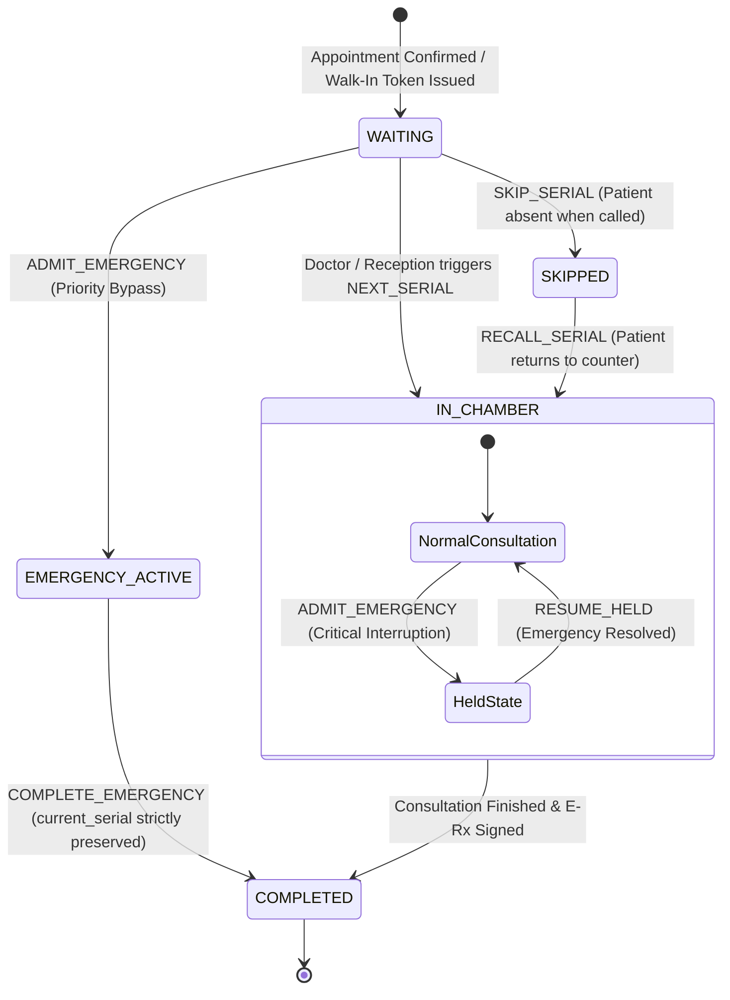
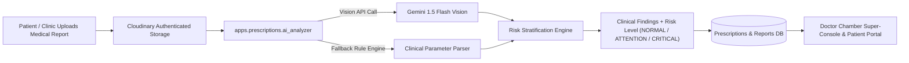

# 🏥 Smart Clinic — Multi-Clinic Healthcare Management & Digital Queue Orchestration Platform

<div align="center">


[](https://react.dev/)
[](https://tailwindcss.com/)
[](https://www.djangoproject.com/)
[](https://ai.google.dev/)
[]()
[](https://www.postgresql.org/)
[]()
[-brightgreen?style=for-the-badge)]()

**An enterprise-grade, distributed clinical ecosystem bridging Clinics, Specialist Doctors, Receptionists, Patients, and Platform Administrators across Bangladesh.**

[Explore Features](#-key-features) • [System Architecture](#-system-architecture) • [Queue State Machine](#-digital-queue-engine--emergency-priority) • [Clinical Innovation Matrix](#-clinical-innovation--ai-architecture) • [Quick Start](#-quick-start-guide) • [Default Credentials](#-default-credentials-development) • [API Documentation](#-api-documentation)

</div>

---

## 🌟 Overview

**Smart Clinic** is an end-to-end, multi-tenant digital health management platform engineered to resolve queue congestion, fragmented medical records, and manual counter discrepancies in healthcare facilities across Bangladesh. 

Benchmarked against regional leaders like [Smart ClinicX by HEALTHx](https://clinic.healthxbd.com/), Smart Clinic eliminates physical waiting room chaos with **real-time live chamber dispatching**, empowers patients with **longitudinal vitals tracking & Gemini AI multimodal medical report analysis**, equips doctors with a **BMDC-standard chamber super-console**, and gives front-desk receptionists an **automated cash drawer reconciliation & denomination handover ledger**.

---

## 🏛️ System Architecture

```mermaid
graph TD
    subgraph "Clients & Public Displays"
        P[Patient Mobile / Web App]
        R[Front-Desk Reception Counter]
        D[Doctor Chamber Workstation]
        A[Clinic Admin Control Tower]
        TV[Waiting Room 4K / 1080p Signage TV]
    end

    subgraph "Application Gateway & Frontend (React 19 + Vite 8)"
        FE[React 19 Single Page App]
        Router[React Router v7]
        AuthCtx[AuthProvider & JWT Interceptor]
        LangCtx[LanguageContext: EN / বাংলা Localization]
        GeoHook[useBangladeshGeo Cascading Hook]
        SpeechEng[Web Speech Dual-Voice Synthesizer]
        VitalsDash[SVG Health Indicator Trend Engine]
    end

    subgraph "Security & API Gateway (Django 5 + DRF)"
        API[Django REST Framework]
        SimpleJWT[SimpleJWT Bearer & Role-Based RBAC]
        Spectacular[OpenAPI 3.0 / Swagger Documentation]
    end

    subgraph "Micro-Services & Domain Modules"
        GeoSvc[apps.common: Bangladesh 8-Division Geo Hierarchy]
        AccSvc[apps.accounts: User Profiles & Security]
        ClnSvc[apps.clinics: Multi-Tenant Clinics, Staff & Shift Logs]
        DocSvc[apps.doctors: Chamber Rosters & Availability]
        AptSvc[apps.appointments: Atomic State Machine & Proximity Dispatch]
        RxSvc[apps.prescriptions: E-Prescriptions & Vitals Auto-Sync]
        AIEng[apps.prescriptions.ai_analyzer: Gemini 1.5 Flash Vision Multimodal]
        PaySvc[apps.payments: SSLCommerz & Cash Drawer Ledgers]
        NotifSvc[apps.notifications: BD SMS & Email Dispatcher]
    end

    subgraph "Persistence & Cloud Storage"
        DB[(PostgreSQL / SQLite Database)]
        Cloudinary[(Cloudinary Authenticated Medical Vault)]
    end

    P & R & D & A & TV --> FE
    FE --> Router --> AuthCtx & LangCtx
    FE --> GeoHook & SpeechEng & VitalsDash
    FE -->|JSON / Bearer JWT| API
    API --> SimpleJWT --> Spectacular
    API --> GeoSvc & AccSvc & ClnSvc & DocSvc & AptSvc & RxSvc & PaySvc & NotifSvc
    RxSvc --> AIEng
    AIEng --> Cloudinary
    GeoSvc & AccSvc & ClnSvc & DocSvc & AptSvc & RxSvc & PaySvc & NotifSvc --> DB
```



---

## 🔄 Digital Queue Engine & Emergency Priority



### Core Concurrency & Queue Invariants:
1. **Immutable Serial Identity**: `Appointment.serial_number` is locked upon creation and never mutates or re-indexes.
2. **Non-Advancing Serial Invariant**: Priority admission of emergency cases strictly preserves `ChamberSession.current_serial`. Normal tokens remain valid without confusing waiting patients.
3. **No Blind Progression (`current_serial += 1` Forbidden)**: Sequential transitions query the database atomically with `select_for_update()` to locate the lowest valid unserved candidate.
4. **Strict Separation of Held vs. Skipped**: Patients interrupted by an emergency are placed into `held_patient` state and are never mixed with `skipped_serials`.

---

## 🧬 Clinical Innovation & AI Architecture

### 1. Multimodal Medical Report AI Analyzer (`ai_analyzer.py`)
- **Visual Diagnostics**: Analyzes CBC, Lipid Profiles, Liver Function Tests (LFT), Renal Function Tests (RFT), HbA1c, and Pathology images uploaded by patients or clinics.
- **Multimodal Pipeline**: Powered by **Google Gemini 1.5 Flash Vision** with clinical rule-based deterministic fallback.
- **Structured Clinical Extraction**: Automatically extracts quantitative parameters with standard reference ranges, abnormal flags (`HIGH`, `LOW`, `CRITICAL`), and contextual bilingual clinical summaries in English and Bengali.
- **AI Suggested Questions**: Generates targeted exploratory questions for the attending physician to accelerate diagnostic interview during chamber visits.



### 2. Patient Longitudinal Vitals & Health Indicator Trends (`PatientVitalLog`)
- **Longitudinal Biomarkers**: Records Systolic BP, Diastolic BP, Pulse Rate, Blood Glucose (Fasting / Random / Postprandial), Weight (kg), and BMI.
- **Automated Prescription Sync**: Vitals recorded during doctor chamber consultations automatically write to the patient's permanent vital log via database signals (`sync_prescription_vitals`).
- **AHA & WHO Threshold Guides**: Built-in visual indicators evaluating Hypertension stages (`Normal <120/80`, `Elevated`, `Stage 1`, `Stage 2`, `Hypertensive Crisis >180/120`) and Diabetes guidelines.
- **Zero-Dependency SVG Trend Charts**: Ultra-lightweight, responsive SVG area and line graphs displaying historical health trajectories over 30, 90, and 365 days.

### 3. Dual Multilingual Voice Callouts on Waiting Room Signage TV
- **Web Speech API Dual Announcement**: When a patient token is called, the display screen synthesizes clear audio announcements:
  - **Bengali**: *"টোকেন নম্বর ১৫, রুম ১০১-এ আসুন"*
  - **English**: *"Token number 15, please proceed to Room 101"*
- **Audio Control Center**: Chime sound alerts, single/dual language selection, voice volume sliders, and mute toggles for clinical environments.

### 4. Receptionist Shift Handover & Drawer Cash Reconciliation (`ShiftClosingLog`)
- **Denomination Matrix Calculator**: Built-in counter for Bangladeshi currency notes (৳1000, ৳500, ৳200, ৳100, ৳50, ৳20, ৳10, and coins) with 1-click auto-fill.
- **Real-Time Variance Ledger**: Instant mathematical discrepancy tracking (`Physical Counted - System Ledger`) highlighting Balanced (✓), Cash Surplus (+৳), or Shortage (-৳).
- **Printable Audit Slip**: Dedicated 80mm thermal and A4 print view containing clinic header, duty officer, token breakdown, denomination details, and dual signature blocks.
- **Fast-Dispatch Hotkey**: Global <kbd>F2</kbd> keyboard shortcut allowing receptionists to instantly call the next token without reaching for the mouse.

### 5. Bangladesh National Geo-Hierarchy Hierarchy
- **Complete Administrative Seeder**: Built-in database architecture comprising **8 Divisions, 64 Districts, and 407 Upazilas** (`apps.common`).
- **Cascading Filter Engine**: Seamless division-to-district cascade in public clinic search, specialist doctor directories, and clinic onboarding registration.

---

## 👥 Personas & Feature Capabilities

| Persona | Key Capabilities & Hardened Features |
| :--- | :--- |
| **Patient** | • Real-time Mobile Queue Tracker (`/track/<uuid>`) with live position and wait times.<br/>• Longitudinal Vitals Graphing (BP, Glucose, Pulse, BMI) with WHO risk guides.<br/>• Medical Report Multimodal AI Analyzer with risk flags & suggested doctor questions.<br/>• Cryptographic QR Prescription Verification portal.<br/>• Online booking with SSLCommerz gateway & instant PDF appointment slip download. |
| **Doctor** | • Chamber Super-Console with historical vitals drawer and comparison deltas.<br/>• Live patient consultation queue controls: Next, Skip, Recall, Hold, and Emergency Bypass.<br/>• Direct inspection of patient reports with AI Risk Badges (`NORMAL`, `ATTENTION_NEEDED`, `CRITICAL`).<br/>• Rapid Follow-up Scheduling chips (`+7 Days`, `+14 Days`, `+1 Month`, Custom Date).<br/>• Standard BMDC A4 Prescription Generator with diagnosis, Rx dosage, advice, and follow-up notes. |
| **Receptionist** | • Standalone Front Desk Workstation (`/dashboard/receptionist`).<br/>• Lightning-fast token dispatch via <kbd>F2</kbd> keyboard hotkey.<br/>• Instant Walk-in Token Generation and 80mm thermal receipt printing (`TokenPrintModal`).<br/>• Lossless Token Reprinting without serial corruption.<br/>• Shift Closing & Cash Reconciliation with Bangladeshi denomination breakdown & printable audit slips. |
| **Clinic Admin** | • Multi-Chamber scheduling, specialist roaster, and room allocation.<br/>• Diagnostic test catalog & pricing management (ECG, USG, CBC, X-Ray, etc.).<br/>• Staff attendance tracking (`PRESENT`, `LATE`, `LEAVE`, `ABSENT`) and monthly payroll management.<br/>• Virtual Clinic Showcase with high-res photo gallery and amenities badge configuration. |
| **Waiting Room TV** | • High-contrast 4K/1080p full-screen lounge display (`/queue/waiting-room`).<br/>• Dual Multilingual Speech Synthesis (Bengali + English voice callouts).<br/>• Real-time chamber status broadcast (`In Chamber`, `Prayer Break`, `In Transit`, `Emergency`). |
| **Super Admin** | • Nationwide clinic verification and BMDC registration audits.<br/>• Platform-wide transaction volumes, doctor onboarding, and geographical distribution telemetry. |

---

## 💻 Tech Stack & Dependencies

| Domain | Technology | Key Packages / Specifications |
| :--- | :--- | :--- |
| **Frontend SPA** | React 19 + Vite 8 | React Router v7, Axios, Lucide React |
| **Styling & Design** | Tailwind CSS + DaisyUI 5 | Custom CSS variables, responsive typography, print-friendly media queries |
| **Audio Engine** | Web Speech API | Dual synthesized Bengali & English speech synthesis |
| **Backend API** | Django 5.x + DRF | Django REST Framework, SimpleJWT, django-cors-headers, drf-spectacular |
| **AI Vision Engine** | Google Gemini 1.5 Flash | Multimodal report analysis & clinical parameter extraction |
| **Database** | SQLite (Dev) / PostgreSQL (Prod) | Normalized relational models with atomic transactions (`select_for_update`) |
| **Payments** | SSLCommerz & Cash Ledger | Multi-currency BDT sandbox/live gateway with IPN validation |
| **SMS Gateway** | BD Telco Gateway Simulator | Automated SMS dispatch for token creation and E-Prescription readiness |

---

## 🚀 Quick Start Guide

### Prerequisites
- **Node.js**: `v18.x` or higher
- **Python**: `v3.10` or higher
- **Git**

---

### 1. Clone the Repository
```bash
git clone https://github.com/Ishtiak-Ahmed886/Final_Year_Project_version1.git
cd Final_Year_Project_version1
```

---

### 2. Backend Setup (Django)

```bash
cd clinic_backend

# 1. Create and activate Python virtual environment
python -m venv venv

# Windows:
venv\Scripts\activate
# Linux/macOS:
source venv/bin/activate

# 2. Install Python dependencies
pip install -r requirements.txt

# 3. Apply all database migrations
python manage.py migrate

# 4. Seed Bangladesh 8 Divisions, 64 Districts, and 407 Upazilas
python seed_bangladesh_geo.py

# 5. Seed realistic demo data across all administrative divisions
python seed_eight_divisions.py

# 6. Start the development server
python manage.py runserver
```
*Backend API will run at: `http://127.0.0.1:8000/`*

---

### 3. Frontend Setup (React 19 + Vite)

Open a new terminal window:

```bash
cd smart-clinic

# 1. Install Node dependencies
npm install

# 2. Start Vite development server
npm run dev
```
*Frontend client will run at: `http://localhost:5173/`*

---

## 🧪 Testing & Quality Assurance

### Run Backend Unit & Integration Tests (148 Passing Tests)
```bash
cd clinic_backend
python manage.py test apps.common.tests apps.clinics.tests apps.prescriptions.tests
```

### Build Frontend Production Bundle (0 Errors)
```bash
cd smart-clinic
npm run build
```

---

## 📑 Default Credentials (Development)

All seeded test accounts across all divisions use the password: **`Password123!`**.

| Role | Email | Password | Location / Clinic |
| :--- | :--- | :--- | :--- |
| **Super Admin** | `admin@clinic.com` | `Password123!` | Nationwide Control |
| **Clinic Admin** | `metro_dhaka@clinic.com` | `Password123!` | Dhaka (Uttara) |
| **Clinic Admin** | `nexus_mymensingh@clinic.com` | `Password123!` | Mymensingh Sadar |
| **Receptionist** | `staff_metro@clinic.com` | `Password123!` | Dhaka (Uttara) |
| **Specialist Doctor** | `nurul_rangpur@doctor.com` | `Password123!` | Rangpur Specialized Clinic |
| **Specialist Doctor** | `tariqul_ctg@doctor.com` | `Password123!` | Chattogram Central Hospital |
| **Patient** | `test_patient_e2e@example.com` | `Password123!` | Dhaka |

---

## 📖 API Documentation

With the backend running, explore the interactive API schema:
- **Swagger UI**: [http://127.0.0.1:8000/api/docs/](http://127.0.0.1:8000/api/docs/)
- **Redoc UI**: [http://127.0.0.1:8000/api/redoc/](http://127.0.0.1:8000/api/redoc/)
- **OpenAPI Schema**: [http://127.0.0.1:8000/api/schema/](http://127.0.0.1:8000/api/schema/)

---

<div align="center">
  <sub>Engineered with precision for modern healthcare infrastructure in Bangladesh. Built by <a href="https://github.com/Ishtiak-Ahmed886">Ishtiak Ahmed</a>.</sub>
</div>
